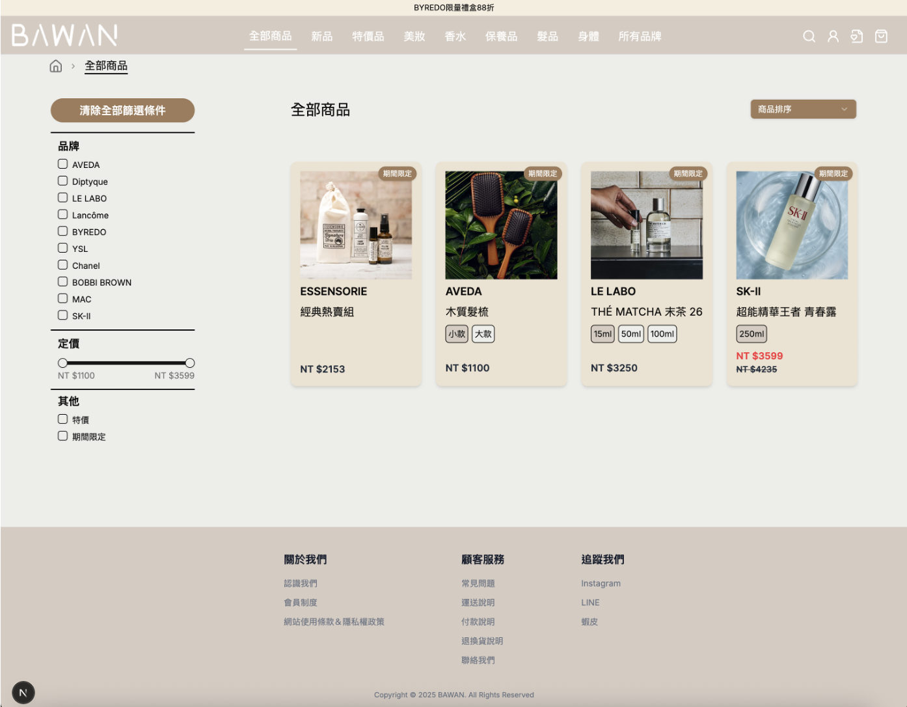
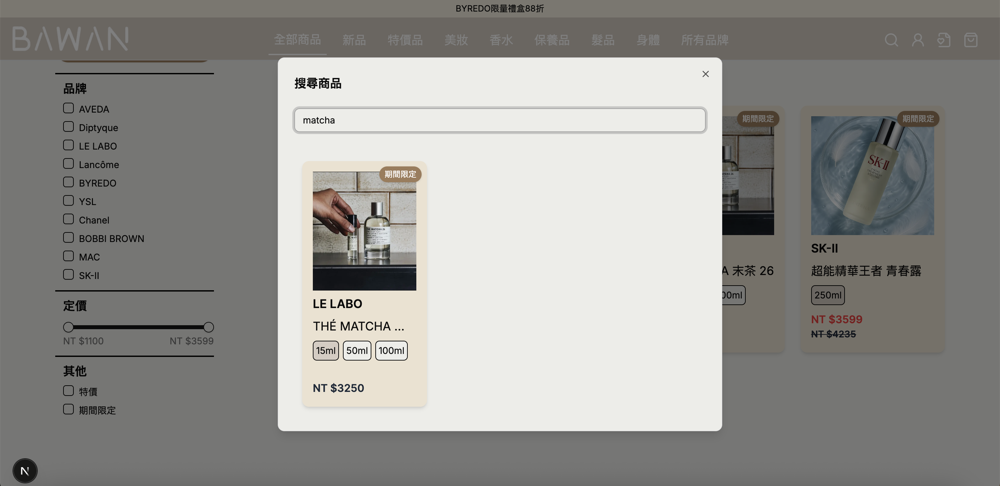
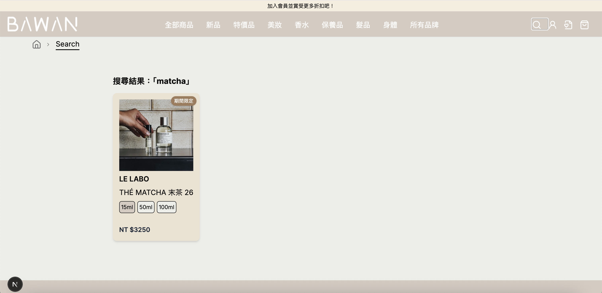
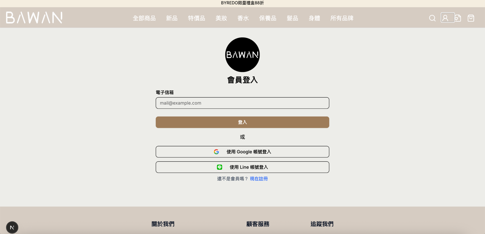
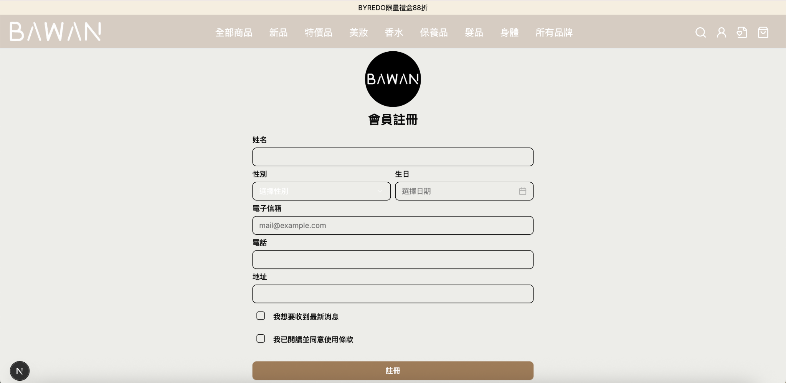

# BAWAN – Beauty Product Buying Agency Web App

**BAWAN** is a full-stack web application built for a Taiwanese beauty product buying agency. It allows users to browse and purchase authentic skincare, makeup, haircare, and fragrance items, while admins can manage product listings with ease. The system features, layout, and color theme were all tailored in collaboration with the client to reflect a minimalist Korean-style aesthetic.

> ⚠️ This project is still in progress. Some features, such as the admin dashboard, are under development.

## ✨ Features

### For Customers:

- **Product Browsing & Filtering**  
  Navigate a curated collection of beauty products using category filters, brand filters, price sliders, and sorting options.  
  

- **Real-Time Search Function**  
  Use the search icon in the navbar to open a dialog for real-time search. As users type, product results instantly update. Pressing enter brings users to a full search result page.  
    
  

- **Product Cards with Dynamic Sizing**  
  Each product card displays available sizes with corresponding prices. Users can select sizes to instantly view price changes—without navigating away from the page.

- **Wishlist & Secure Checkout**  
  Add items to a personal wishlist or proceed with secure checkout seamlessly.

### For Admin:

- _(In Progress)_ A dedicated admin dashboard is planned, allowing authenticated admins to upload and manage product listings—including product images, sizes, and prices—via a user-friendly interface.
- Currently, products are added manually during development.

### Authentication:

- **Login Options**  
  Magic link via email or third-party login (Google, LINE).  
  

- **Signup Page**  
  Includes gender, birthdate, and contact fields.  
  

## 🛠 Tech Stack

- **Frontend**: [Next.js](https://nextjs.org/), [Tailwind CSS](https://tailwindcss.com/), [Shadcn UI](https://ui.shadcn.com/)
- **Backend**: [Prisma ORM](https://www.prisma.io/) with [Vercel Postgres](https://vercel.com/postgres)
- **Deployment**: [Vercel](https://vercel.com/)

## 🚀 Deployment

The application is live and accessible at:

<!-- 🔗 [https://your-bawan-app.vercel.app](https://your-bawan-app.vercel.app) -->

## 📦 Getting Started (Local Development)

1. **Clone the repository**
   ```bash
   git clone https://github.com/your-username/bawan.git
   cd bawan
   pnpm install
   pnpm dev
   ```
