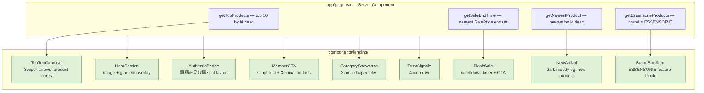

# Plan: Landing Page (Figma-matched)

## Prototype

`public/prototype/cream1.png` — full-page Figma prototype screenshot. Use this to verify layout and design against the implementation.

## Goal

Implement the Figma-designed landing page for `/`. Anonymous visitors and members see a full marketing page that matches the warm-beige bawan aesthetic. Done means all 9 sections rendered, responsive, data-driven where applicable, AOS animated on scroll.

## Architecture / flow

## Section breakdown (Figma-matched)

### S1 — HeroSection
- Full-viewport, illustrated feel via `beauty.jpeg` + warm yellow/green gradient overlay (placeholder until real illustrated art is provided)
- Centered product image (`/public/img/Diptyque/diptyque_discovery_set.png`) floating on top
- No text — visual-only hero

### S2 — TopTenCarousel (～TOP 10～)
- `getTopProducts()` — newest 10 from DB
- Swiper, `slidesPerView: 4` desktop / `2` mobile, prev/next arrows
- Each slide: product image, brand, name, NT$ price
- Section label ～TOP 10～ with tilde decoration

### S3 — FlashSale (限時折扣)
- Left: live `HH:MM:SS` countdown (`setInterval`, client component)
- Right: "限時折扣 滿$2000 享9折！" + "立即選購" button → `/products`
- `getSaleEndTime()` — nearest `SalePrice.endsAt`; fallback to static +24h if none
- Background `#F5EEE0`

### S4 — AuthenticBadge (專櫃正品代購)
- Split layout: large headline left, product lifestyle image right (`/public/img/LE LABO/lelabo2.jpeg`)
- "不必付專櫃價！" subtext, "探索更多" button → `/products`

### S5 — NewArrival (～NEW～)
- Full-width dark background (`doson1.png` or `ipsa.jpg` + dark overlay)
- Left: category chip, large headline (newest product name from DB), description, "探索香水" → `/products?category=香氛香水`
- Right: product image
- `getNewestProduct()` — most recent product

### S6 — BrandSpotlight (ESSENSORIE)
- Beige card, left: ESSENSORIE product image, right: "墨爾本必買 ESSENSORIE", "台灣無專櫃！！！", static brand description
- `getEssensorieProducts()` — `brand = "ESSENSORIE"`

### S7 — MemberCTA
- Left: "Beauty begins with you" in italic serif / Dancing Script Google Font
- Right: headline, sub-copy, 3 buttons: 加入會員 → `/signup`, Instagram → IG URL, LINE 詢問 → LINE URL (both from `constant/index.ts`)
- Background `#F5EEE0`

### S8 — CategoryShowcase
- 3 arch-shaped tiles: BEAUTY (`beauty.jpeg`), BODY (`body.png`), HAIR (`aveda.png`)
- Arch CSS: `border-radius: 50% 50% 0 0 / 60% 60% 0 0`
- Links: `/products?category=美妝`, `/products?category=身體`, `/products?category=髮品`

### S9 — TrustSignals
- 4 items: 專櫃正品 (`quality_guarantee.png`), 全館滿$1500免運 (Lucide `Truck`), 品質保證 (Lucide `BadgeCheck`), 比專櫃低價 (`price.png`)

## Scope

### May modify
- `app/page.tsx`
- `app/utils/actions.ts` — add 4 new actions
- `components/landing/` — 9 new files
- `components/homepage.tsx` — delete (stub only)
- `app/layout.tsx` — add Dancing Script via `next/font/google`

### Must not modify
- `auth.ts`, `prisma/schema.prisma`, `app/api/**`
- `components/account/**`, `components/navbar.tsx`, `components/footer.tsx`
- `components/products/ProductCard.tsx`
- Existing e2e tests

## Constraints
- No new npm packages
- `next/image` + `priority` on hero
- Graceful empty states on all DB-driven sections
- Mobile-first responsive

## Verification

### e2e tests (`e2e/landing/landing.spec.ts`)
1. Hero loads, CTA button present and links to `/products`
2. TOP 10 carousel: at least 1 product card with brand + price
3. Category tiles: BEAUTY / BODY / HAIR present and link to `/products`

### Manual
- Countdown ticks in real time
- No broken images at desktop + mobile (375px / 1280px)
- AOS scroll animations trigger

## Done definition
- [ ] All 9 sections match Figma layout
- [ ] 3 e2e tests pass
- [ ] Countdown live
- [ ] No broken images
- [ ] `npm run build` passes

## Risks & rollback
- **Hero art**: Figma uses a custom illustrated background not in `/public`. Placeholder = `beauty.jpeg` + gradient. Swap when Angela provides the PNG.
- **Dancing Script**: loaded via `next/font/google` — same pattern as existing Noto Sans TC, no extra config needed.
- **Rollback**: `app/page.tsx` is 5 lines; delete `components/landing/` for full rollback.

## Open questions
- Hero illustrated PNG: confirm using `beauty.jpeg` + overlay as placeholder, or can you drop the illustrated PNG into `/public/img/`?
- The Figma shows a newsletter/email section merged into MemberCTA (S7) — no separate email form needed, correct?
